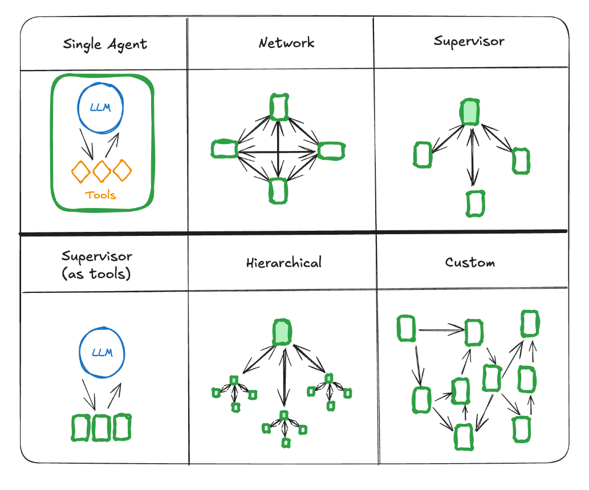
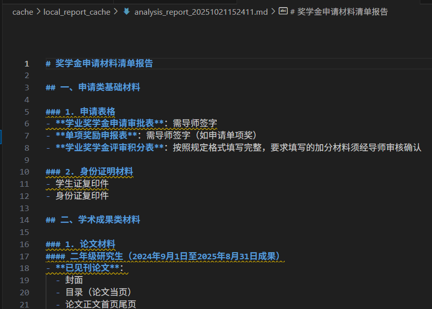

# Agent 的实现

下图是 langgraph 官网给出的几种 multi-agent 实现架构：




本项目先基于较为简单的 Supervisor 架构快速搭一个demo出来，需要实现工作节点：
- Text2SQL Agent
- 数据操作 Agent
- 分析报告生成 Agent

## Text2SQL Agent

目的：根据用户输入的自然语言，生成对应的 SQL 查询语句，并将对应sql查询结果以csv样式保存。

实现参考：[sql-agent](https://langchain-ai.github.io/langgraph/tutorials/sql/sql-agent/)

测试代码：
```python
text2sql_agent = Text2SQLAgent()
agent = text2sql_agent.get_agent()
question = "你数据库存储了什么数据，能解答我什么问题？？？"

# 流式输出 Agent 执行过程（包含工具调用、查询结果、最终回答）
for step in agent.stream(
    {"messages": [{"role": "user", "content": question}]},
    stream_mode="values",  # 按步骤输出关键信息
):
    # 打印每一步的最后一条消息（人类问题、AI 工具调用、工具返回结果、最终回答）
    step["messages"][-1].pretty_print()
```

## Statistic Agent

目的：根据用户输入的自然语言，以及指定的csv文件路径，统计csv文件中的数据，返回对应信息。

## Analysis Agent

目的：根据用户输入的自然语言，可以从neo4j中检索相关知识，共同组成一份分析报告。支持报告的存储，将会存储在 `database/analysis_reports` 目录下。

测试代码：
```python
analysis_agent = AnalysisAgent()
agent = analysis_agent.get_agent()
question = "我想知道申请奖学金需要提供什么材料，结果帮我保存下来"

# 流式输出 Agent 执行过程（包含工具调用、查询结果、最终回答）
for step in agent.stream(
    {"messages": [{"role": "user", "content": question}]},
    stream_mode="values",  # 按步骤输出关键信息
):
    # 打印每一步的最后一条消息（人类问题、AI 工具调用、工具返回结果、最终回答）
    step["messages"][-1].pretty_print()
```

生成结果：
