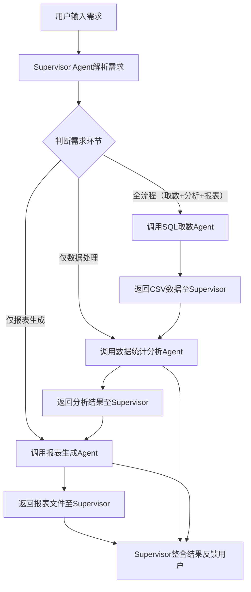

# 数据分析多Agent系统（Multi-agent Supervisor架构）PRD
## 1. 文档基础信息
| 项目 | 内容 |
| ---- | ---- |
| 文档名称 | 数据分析多Agent系统产品需求文档（PRD） |
| 产品版本 | V1.0 |
| 目标用户 | 数据分析师、业务运营人员、需自主获取并分析数据的业务人员 |
| 核心架构 | Multi-agent Supervisor（1个Supervisor Agent + 3个Worker Agent） |
| 文档状态 | 初稿 |

## 2. 产品目标
通过多Agent协作，自动化完成“SQL取数-数据统计分析-报表生成”的数据分析全流程，降低用户操作门槛，减少人工干预，提升数据分析效率，支持用户快速获取结构化数据结果与可视化报表。

## 3. 功能需求
### 3.1 整体交互流程
用户输入数据分析需求→Supervisor Agent解析需求→按流程调用对应Worker Agent→各Agent执行任务并返回结果→Supervisor Agent整合结果反馈给用户，流程示意图如下：

### 3.2 Supervisor Agent功能
#### 3.2.1 需求解析
- 能识别用户需求中的核心指令，区分“全流程需求”（如“从用户库取2024年注册用户数据，计算每月注册量均值，生成Markdown报表”）与“单一环节需求”（如“处理内存中user.csv的缺失值”）。
- 支持识别需求中的关键信息，包括数据库名称、数据表名称、时间范围、统计指标、报表类型等。

#### 3.2.2 任务调度
- 按需求类型顺序调用Worker Agent，全流程需求需依次调用“SQL取数Agent→数据统计分析Agent→报表生成Agent”，禁止并行调用。
- 实现中间数据传递，将前一Agent的输出（如SQL取数Agent生成的CSV数据）作为后一Agent的输入，确保数据流转完整。

#### 3.2.3 异常处理
- 当SQL取数Agent查询失败（如SQL语法错误、数据库连接超时），需向用户反馈失败原因，并询问是否重试或终止任务。
- 当数据统计分析Agent处理异常（如CSV格式错误、统计指标无法计算），需暂停流程，提示用户检查数据或调整需求。
- 当报表生成Agent导出失败（如文件权限不足），需告知用户异常，并提供备选导出路径。

#### 3.2.4 结果整合
- 接收各Worker Agent的执行结果，按用户需求格式整合信息，如全流程需求需包含“取数来源、分析过程、报表文件”三部分内容。
- 以清晰的自然语言向用户反馈最终结果，支持直接提供报表文件下载链接或内存数据预览。

### 3.3 SQL取数Agent功能
#### 3.3.1 SQL生成
- 根据Supervisor传递的需求信息（如数据库、数据表、筛选条件），生成语法合规的SQL查询语句，支持MySQL、PostgreSQL等主流数据库语法。
- 具备SQL语法校验能力，自动修正简单语法错误（如缺少分号、字段名拼写错误），复杂错误反馈至Supervisor。

#### 3.3.2 数据库连接与查询
- 支持配置多数据库连接信息（IP、端口、账号、密码），通过用户授权的连接参数建立数据库连接。
- 执行生成的SQL语句，获取查询结果，支持处理百万级以内数据量的查询请求，查询超时时间可配置（默认30秒）。

#### 3.3.3 数据格式转换
- 将SQL查询结果转换为标准CSV格式，确保字段名、数据类型与查询结果一致，空值以统一标识（如“NA”）填充。
- 将CSV数据存储至指定内存地址，并记录数据索引信息，反馈给Supervisor以便后续Agent调用。

### 3.4 数据统计分析Agent功能
#### 3.4.1 数据读取与校验
- 从Supervisor指定的内存地址读取CSV数据，校验数据格式（如字段数量、数据类型匹配），格式错误反馈至Supervisor。
- 支持预览数据前10行，向Supervisor反馈数据基本信息（数据行数、字段列表、数据类型分布）。

#### 3.4.2 数据清洗
- 自动执行基础数据清洗操作，包括去重（删除完全重复的行）、缺失值处理（数值型字段用均值填充，字符型字段用“未知”填充）、异常值过滤（基于3σ原则剔除数值型字段异常值）。
- 支持根据用户需求自定义清洗规则，如指定缺失值填充方式、异常值阈值。

#### 3.4.3 统计分析
- 支持常见统计指标计算，包括均值、方差、中位数、最大值、最小值、频数分布等，可根据Supervisor传递的需求自动选择对应指标。
- 支持按指定维度分组分析（如按“月份”分组计算销售额总和），支持多维度组合分析（如按“地区+月份”分组）。
- 将分析结果以结构化格式（如JSON、表格）返回给Supervisor，包含“分析指标、计算过程、结果数值”信息。

### 3.5 报表生成Agent功能
#### 3.5.1 报表类型支持
- 支持生成多种类型报表，包括Markdown表格（适合简单数据展示）、Excel文件（适合多sheet数据存储）、PDF报表（适合正式汇报场景）。
- 支持生成数据可视化图表，包括折线图（趋势分析）、柱状图（对比分析）、饼图（占比分析），图表样式可配置（颜色、字体、标题）。

#### 3.5.2 报表内容填充
- 从Supervisor获取分析结果数据，按预设模板填充报表内容，Markdown报表需包含数据来源、统计指标说明、结果表格；Excel报表支持分sheet存储“原始数据、清洗后数据、分析结果”；PDF报表需包含图表与文字说明。
- 支持用户自定义报表标题、表头样式、数据格式（如数值保留2位小数、日期格式为“YYYY-MM-DD”）。

#### 3.5.3 报表导出与反馈
- 将生成的报表文件导出至用户指定路径或系统默认存储路径，支持生成文件下载链接（有效期24小时）。
- 向Supervisor反馈报表生成状态（成功/失败）、文件格式、文件大小、存储路径等信息。

## 4. 非功能需求
### 4.1 性能需求
- 单流程响应时间：全流程（取数+分析+报表）处理10万行以内数据时，响应时间≤60秒；单一环节处理时，响应时间≤30秒。
- 并发能力：支持50个用户同时发起请求，系统无崩溃、数据无丢失，并发请求响应时间延迟不超过正常响应时间的50%。

### 4.2 安全需求
- 数据库连接信息加密存储，采用AES加密算法，禁止明文存储账号、密码。
- 用户数据隔离，不同用户的内存数据、报表文件独立存储，禁止跨用户访问。
- 操作日志记录，记录用户需求、Agent调用记录、异常信息，日志保留时间≥30天，支持日志查询与导出。

### 4.3 兼容性需求
- 数据库兼容性：支持MySQL 5.7+、PostgreSQL 10+、SQL Server 2017+等主流关系型数据库。
- 报表格式兼容性：生成的Excel文件支持Office 2016+、WPS 2019+打开；PDF报表支持Adobe Acrobat、福昕阅读器等主流软件打开；Markdown报表支持GitHub、GitLab等平台渲染。
- 浏览器兼容性：若提供Web访问界面，支持Chrome 90+、Firefox 88+、Edge 90+等主流浏览器。

### 4.4 易用性需求
- 用户交互：支持自然语言输入需求，无需用户掌握SQL语法或编程知识，复杂需求可通过多轮对话补充信息。
- 错误提示：异常信息提示清晰易懂，避免专业术语堆砌，提供明确的问题解决建议（如“SQL查询失败，可能原因：数据表不存在，请确认数据表名称是否正确”）。
- 帮助文档：提供系统使用指南，包含常见需求示例（如“如何获取指定时间范围的销售数据并生成报表”）、常见问题解答（FAQ）。